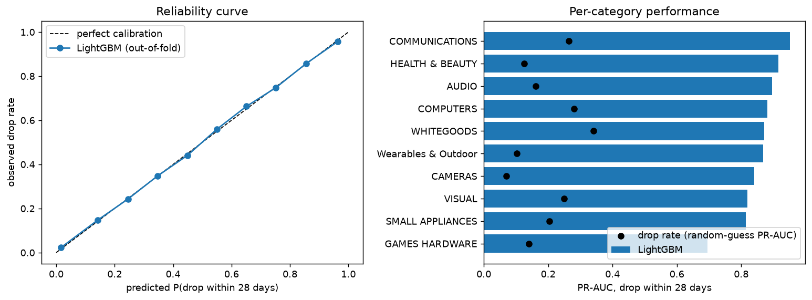
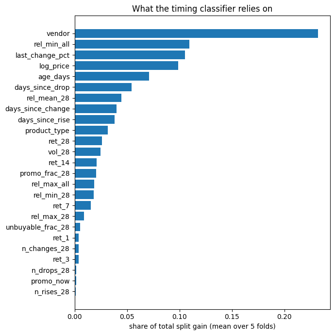
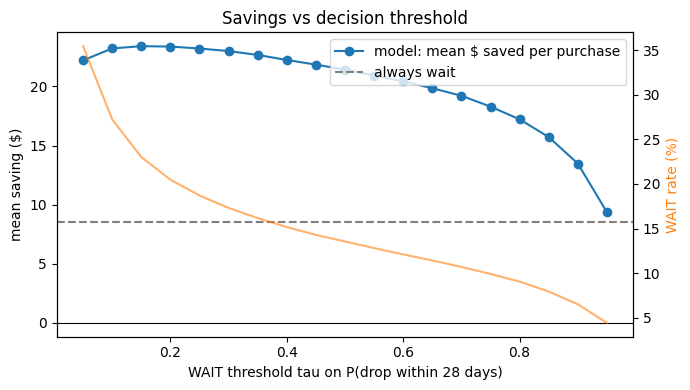
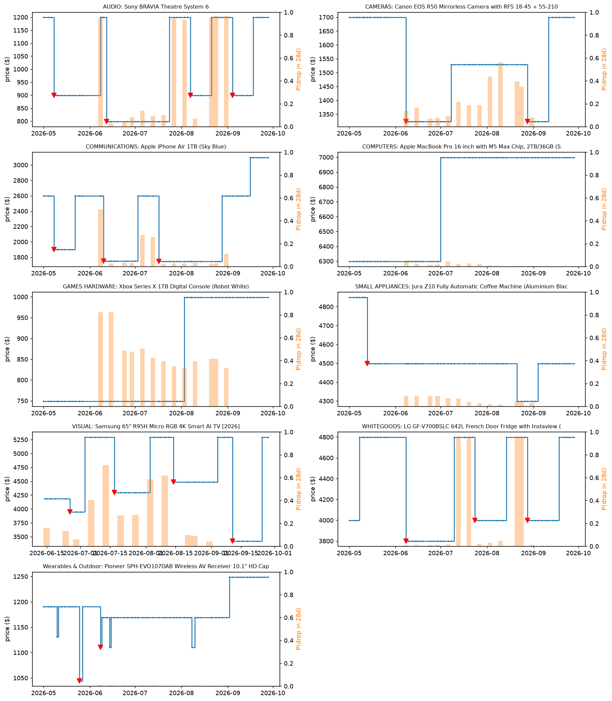

# 1. Link to implementation

Colab notebook (public, self-contained):

[https://colab.research.google.com/github/Arham2702/jbhifi-price-drop-ml/blob/main/notebooks/ADAA_A2_price_drop.ipynb](https://colab.research.google.com/github/Arham2702/jbhifi-price-drop-ml/blob/main/notebooks/ADAA_A2_price_drop.ipynb)

Source repository (notebook, data snapshot, export script):

[https://github.com/Arham2702/jbhifi-price-drop-ml](https://github.com/Arham2702/jbhifi-price-drop-ml)

# 2. Project report

## 2.1 Problem definition

**Motivation.** Electronics prices at JB Hi-Fi move often: a TV, laptop or vacuum may be marked down for a week and then return to its usual price.
A shopper deciding *today* faces a concrete question: **buy now, or wait for a drop?** Retailers do not publish price history, and simple rules of
thumb ("wait for a sale") ignore that most products do not drop in any given month, so waiting has a real cost (time, and the risk that the price rises).
I collect my own daily scrapes of the full JB Hi-Fi online catalogue, which makes it possible to learn, from tens of thousands of products,
which pricing patterns tend to come before a drop.

**Why machine learning.** A hand-written rule cannot capture the many interacting signals (recent price rises, promotion flags, stock status,
category-specific pricing cycles, brand). Conditions for learning are met: the outcome (a later price) is observed automatically, labelled examples are plentiful
(175,038 decision points across 15,322 products), and patterns plausibly generalise across products because retailers apply similar
pricing mechanics (promotional cycles, clearance, price matching) across the catalogue.

**Unit of prediction.** One *sample* is one product (SKU) that is buyable on the JB Hi-Fi website on a decision day *t*.

**Input (training and deployment are identical).** A vector of 23 numeric features and 2 categorical features, computed *only* from data up to and including day *t*:


| group                   | features (meaning)                                                                                                                                                                                   |
| ----------------------- | ---------------------------------------------------------------------------------------------------------------------------------------------------------------------------------------------------- |
| price level             | `log_price` — log of today's price in AUD                                                                                                                                                            |
| momentum                | `ret_k` for k = 1, 3, 7, 14, 28 — relative price change over the last k days                                                                                                                         |
| position in own history | `rel_max_all`, `rel_min_all` — today's price relative to the highest / lowest price seen since the product was first scraped; `rel_max_28`, `rel_min_28`, `rel_mean_28` — same over the last 28 days |
| activity                | `vol_28` — std. dev. of daily log price changes (28 days); `n_changes_28`, `n_drops_28`, `n_rises_28` — counts of any change / drops of >= 5% / rises of >= 5% in 28 days                            |
| recency                 | `days_since_change`, `days_since_drop`, `days_since_rise`, `last_change_pct`, `age_days` (days since first scraped)                                                                                  |
| promotion and stock     | `promo_now` (JB "on promotion" flag), `promo_frac_28`, `unbuyable_frac_28` (share of scrapes in 28 days when the listing was not buyable)                                                            |
| product                 | `product_type` (10 JB categories, e.g. VISUAL = TVs), `vendor` (brand; top 150, others grouped as OTHER)                                                                                             |


Raw data behind the features: scrapes every 2-3 days (1 May to 28 Sep 2026) of `price` (AUD, > 0), `on_promotion` (boolean), listing status
(`Buy` = purchasable online; recorded from June onwards), category, brand and model number. Prices are carried forward between scrapes.
Missing values (e.g. a product first seen 10 days ago has no 28-day return) are left as NaN and handled natively by the model.

**Output.**

1. A probability vector $\hat{\mathbf p} = (\hat p_0, \hat p_1, \hat p_2, \hat p_3)$, summing to 1, over *when the first drop of at least 5% happens*:
  within 1-7 days, 8-14 days, 15-28 days, or no such drop within 28 days. A drop at day $t+d$ is counted only if the *next* scrape is also at least 5% below today's price (persistence rule against one-scrape glitches).
2. A real number: the expected depth of that first drop, in percent of today's price.
3. Derived for deployment: $P(\text{drop within 28 days}) = 1-\hat p_3$, the expected price if a drop happens, and a recommendation: **WAIT** if $\hat p_0 + \hat p_1 + \hat p_2 > \tau$, else **BUY NOW** ($\tau$ tuned on savings, section 2.3).

Deployment interface in the notebook: `predict_drop(sku, as_of_date) -> {p_bucket, p_drop_28d, expected_drop_pct_if_drop, expected_price_if_drop, recommendation}`.

**Ground truth.** For a past decision day the true bucket and depth are read off the later scrapes $t+1 \dots t+28$. Only decision days up to 31 August are
used, because their full 28-day future is observed by the last scrape (28 September). Later days have unknown (right-censored) outcomes and are excluded.

**Core challenges identified.** (i) Drops are rare (16.3% of decision points are followed by a >= 5% drop within 28 days), so accuracy is meaningless and probability quality matters;
(ii) samples from the same product are correlated, so evaluation must hold out whole products; (iii) the training loss (cross-entropy over buckets)
is not the shopper's objective (dollars saved), so a separate business metric is needed; (iv) only ~5 months of data, so yearly sales events
(Black Friday, Boxing Day) are absent.

**Research question.** JB Hi-Fi advertises price matching. *Does knowing a competitor's (The Good Guys') current price improve prediction of JB's drops?*
Tested by an ablation on the products sold by both retailers.

## 2.2 Machine learning approach


### System overview

```
Supabase (my scraper's tables) --read-only export--> Parquet snapshot (GitHub)
  -> cleaning: remove partial scrape days, one row per SKU per day, drop non-buyable prices
  -> daily grid (151 days x SKUs) -> labels (bucket, depth) and features (past-only windows)
  -> weekly decision dates (1 Jun - 31 Aug) -> samples
  -> 5-fold GroupKFold by SKU: baselines vs LightGBM classifier + regressor
  -> metrics, calibration, buy-or-wait simulator -> final model -> predict_drop() demo on Top-10
```

**Data.** My own Supabase database (`All JB Hifi Products`, 6.07M rows, 132,897 SKUs). The export keeps 10 appliance categories
(TVs, computers, phones, audio, games hardware, whitegoods, small appliances, cameras, wearables & outdoor, health & beauty), price >= $50, from 1 May 2026,
and SKUs buyable on at least 20 scrape days. Accessories, IT peripherals and categories with no observed drops were excluded.
The snapshot (about 9 MB of Parquet, published with the notebook) has **15,322 products and 877,585 SKU-day price rows**, plus 398,712 The Good Guys
price rows for matching model numbers; `scripts/export_supabase.py` regenerates it from the database.
After weekly sampling of decision dates (13 dates, 8 Jun - 31 Aug) there are **175,038 labelled samples**.

### Model and justification

**Hypothesis class:** gradient-boosted decision trees (LightGBM). For each class $c$ the model computes a score $F_c(x) = \sum_{m=1}^{M} f_{m,c}(x)$,
where each $f_{m,c}$ is a regression tree (up to 63 leaves), and outputs softmax probabilities $\hat p_c(x) = e^{F_c(x)}/\sum_k e^{F_k(x)}$.

**Why:** the inputs are tabular, heterogeneous (ratios, counts, days, categories) and interact non-linearly (a recent 10% rise means something different
for a TV than for a camera lens). Trees need no scaling, handle missing values and categorical variables natively, and train in seconds on ~10^5 rows.
A neural sequence model was considered but would need more data per product than 5 months provide; it is left as future work (section 2.4).

**Two models:**

- **Timing classifier** — `objective = multiclass`, loss = multi-class cross-entropy $L = -\frac1n\sum_i \log \hat p_{y_i}(x_i)$.
- **Depth regressor** — `objective = huber` with $\delta = 5$ percentage points, trained only on samples where a drop occurred:
$\ell(r) = \tfrac12 r^2$ if $|r| \le \delta$, else $\delta(|r| - \tfrac12\delta)$. Huber was chosen over squared error because a few clearance drops of 40-60%
would otherwise dominate the fit; it behaves like MSE for typical drops and like absolute error for outliers.


### Training procedure

- **Optimiser:** gradient boosting with second-order (Newton) steps — each new tree is fitted to the gradient and Hessian of the loss with respect to the
current scores; learning rate 0.05.
- **Hyperparameters:** `num_leaves` 63 (classifier) / 31 (regressor), `min_child_samples` 100 / 50, `feature_fraction` 0.8, `bagging_fraction` 0.8,
L2 regularisation 1.0. Number of trees chosen by **early stopping** (patience 50) on a validation set of 10% of the *training SKUs* (grouped, so no product
appears in both).
- **Class weights:** not used in the main model — weighting rare classes up improves their recall but distorts the probabilities, which the decision rule
relies on. A weighted variant is compared in section 2.3.
- **Baselines:** (A) overall class frequencies of the training fold; (B) class frequencies per product category; for depth, the median drop depth per category.


### Evaluation procedure and metrics

- **Main split: 5-fold GroupKFold by SKU** — every product's samples are in one fold, so the model is always scored on products it never saw.
A random row split would leak: consecutive weeks of the same product are nearly identical.
- **Secondary split: time** — train on decision dates up to 15 July, 28-day gap, test on 12-31 August.
- **Metrics:** log loss (the training loss), multi-class Brier score, ROC-AUC and PR-AUC for "drop within 28 days" (PR-AUC because positives are rare),
expected calibration error (ECE), depth MAE in percentage points and dollars, skill scores $\text{skill} = 1 - \text{metric}_{model}/\text{metric}_{baseline}$,
95% bootstrap CIs resampling SKUs, and the buy-or-wait savings simulation.


## 2.3 Results

All numbers are from the saved run of the published notebook (LightGBM 4.7.0, scikit-learn 1.9.1). Re-running it on Colab, with other library
versions, changes metrics only in the third decimal (for example GroupKFold PR-AUC 0.848 instead of 0.852, time-split log loss 0.615 instead of 0.640,
model saving $23.37 instead of $23.57); every comparison and conclusion below is unchanged.

**Label distribution.** 1-7 days: 5.8%, 8-14 days: 4.8%, 15-28 days: 5.7%, no drop within 28 days: 83.7%.

### Main result: 5-fold GroupKFold on unseen products (mean ± std over folds)


| model                                      | log loss (lower better) | Brier             | ROC-AUC           | PR-AUC            | ECE           |
| ------------------------------------------ | ----------------------- | ----------------- | ----------------- | ----------------- | ------------- |
| Baseline A: overall class frequencies      | 0.624 ± 0.005           | 0.291 ± 0.003     | 0.500             | 0.163 ± 0.002     | 0.002         |
| Baseline B: class frequencies per category | 0.601 ± 0.005           | 0.283 ± 0.003     | 0.655 ± 0.005     | 0.247 ± 0.005     | 0.003         |
| **LightGBM**                               | **0.271 ± 0.008**       | **0.130 ± 0.004** | **0.953 ± 0.003** | **0.852 ± 0.006** | 0.008 ± 0.002 |


- Skill vs the per-category baseline: **54.9%** lower log loss, **54.0%** lower Brier score.
- 95% bootstrap CIs (resampling SKUs): PR-AUC LightGBM [0.846, 0.860] vs baseline B [0.245, 0.261]; log loss [0.263, 0.278] vs [0.592, 0.610]. The intervals do not overlap.
- Calibration: the reliability curve lies on the diagonal (ECE 0.008): when the model says 30%, about 30% of those products drop.
- **Drop depth** (samples with a drop): MAE **3.8 percentage points ($32.56)** vs 7.9 pp ($62.99) for the per-category median baseline.
- Every category beats its baseline; the weakest is games hardware (PR-AUC 0.70 vs 0.14), the strongest phones (0.95 vs 0.26).



**Timing buckets** (argmax prediction, row-normalised; rows = true bucket):


| true / predicted | 1-7 d    | 8-14 d   | 15-28 d  | no drop  |
| -------------- | -------- | -------- | -------- | -------- |
| 1-7 days       | **0.65** | 0.04     | 0.03     | 0.29     |
| 8-14 days      | 0.07     | **0.60** | 0.04     | 0.29     |
| 15-28 days     | 0.05     | 0.04     | **0.51** | 0.40     |
| no drop        | 0.01     | 0.01     | 0.01     | **0.98** |


Near-term drops are recognised best; drops 15-28 days away are predicted as "no drop" 40% of the time — the further ahead, the less the current price pattern says.

**What the model uses** (share of split gain): `vendor` 23.0%, `rel_min_all` 10.5%, `last_change_pct` 10.5%, `log_price` 10.1%, `age_days` 7.1%, `days_since_drop` 5.3%.
The dominant pattern (visible in the Top-10 plots) is JB's promotional cycle: a product that has just returned from a sale price to its regular price
(`last_change_pct` > 0, price well above its historical minimum) is likely to be discounted again soon.



### Secondary result: later time period (train decisions <= 15 Jul, test 12-31 Aug; 80,173 / 42,314 samples)


| model                     | log loss  | Brier     | ROC-AUC   | PR-AUC    | ECE   |
| ------------------------- | --------- | --------- | --------- | --------- | ----- |
| Baseline A: overall       | 0.604     | 0.280     | 0.500     | 0.156     | 0.004 |
| Baseline B: per category  | **0.580** | 0.272     | 0.667     | 0.243     | 0.022 |
| **LightGBM**              | 0.640     | 0.259     | **0.824** | **0.508** | 0.071 |
| LightGBM + class weights  | 0.678     | 0.274     | 0.816     | 0.492     | 0.080 |
| LightGBM without `vendor` | 0.605     | **0.259** | 0.787     | 0.463     | 0.058 |


On a later period the picture is mixed. The model still **ranks** products far better than the baselines (PR-AUC 0.51 vs 0.24, ROC-AUC 0.82 vs 0.67)
and has the best Brier score, but its **log loss is worse than the per-category baseline** (0.640 vs 0.580) and it is less well calibrated (ECE 0.071).
Log loss punishes confident mistakes very heavily: promotions in late August did not repeat July's pattern for some brands, and the model was confidently wrong on them.
So the model is reliable for *ordering* products by how likely they are to drop, but its probabilities should be recalibrated on recent data before being shown to users (section 2.4).
Class weighting made both ranking and calibration worse, confirming the decision to train unweighted.

### Business metric: buy-or-wait simulation (out-of-fold predictions, threshold tuned on the other folds)


| policy                                                  | mean $ saved per purchase | mean % saved | share of oracle savings | WAIT rate | mean days waited | $ saved per day waited |
| ------------------------------------------------------- | ------------------------- | ------------ | ----------------------- | --------- | ---------------- | ---------------------- |
| Buy now                                                 | 0.00                      | 0.00         | 0%                      | 0%        | 0                | —                      |
| Always wait (buy at first drop, else day 28)            | 8.53                      | −0.29        | 31%                     | 100%      | 25.4             | 0.34                   |
| **Model** (WAIT if P(drop) > τ, τ = 0.15 in every fold) | **23.57**                 | **2.62**     | **86%**                 | 23%       | **4.1**          | **5.73**               |
| Oracle (knows the future)                               | 27.29                     | 3.19         | 100%                    | 17%       | 2.3              | 11.92                  |


95% bootstrap CI for the model's mean saving: **[$22.31, $24.82]** per purchase. Following the model captures 86% of the savings a perfect-foresight
shopper would get, while waiting on average about 4 days; "always wait" makes shoppers wait 25 days for a third of the benefit
(and on average *loses* 0.29% of the price, because prices sometimes rise while waiting).



### Research question: do The Good Guys' prices help? (GroupKFold on 22,373 matched samples, 2,095 products)


| features                                                   | log loss  | Brier     | ROC-AUC   | PR-AUC    | ECE       | best mean saving |
| ---------------------------------------------------------- | --------- | --------- | --------- | --------- | --------- | ---------------- |
| JB features only                                           | 0.530     | 0.264     | 0.938     | 0.900     | 0.019     | $67.37           |
| JB + The Good Guys (`tgg_gap`, `tgg_ret_7`, `tgg_cheaper`) | **0.522** | **0.260** | **0.940** | **0.904** | **0.016** | **$68.17**       |


Answer: **a small, consistent improvement.** Competitor features improve every metric slightly (log loss −1.5%, PR-AUC +0.004, +$0.80 saved per purchase),
consistent with price matching, but the gain is small compared with what JB's own price history provides.
Products sold by both retailers drop much more often (36% vs 16%), so they are also where a shopper gains most from waiting.

### Top-10 flagships (deployment demo, as of 28 Sep 2026)

One flagship per category, chosen by a fixed rule: still listed and buyable, scrape coverage within 10 points of the best in its category,
preferring products The Good Guys also sells, then the highest price.


| category            | product                            | price now | P(drop ≤ 28 d) | expected drop if it drops | recommendation |
| ------------------- | ---------------------------------- | --------- | -------------- | ------------------------- | -------------- |
| Audio               | JBL BAR 1300 MK2 soundbar          | $1,999    | 0.016          | 9.8%                      | BUY NOW        |
| Cameras             | Antigravity A1 8K 360 drone bundle | $2,799    | 0.128          | 17.1%                     | BUY NOW        |
| Phones              | Apple iPhone Air 1TB               | $3,099    | 0.007          | 17.3%                     | BUY NOW        |
| Computers           | Apple MacBook Pro 16" M5 Max 2TB   | $7,999    | 0.000          | 17.5%                     | BUY NOW        |
| Games hardware      | Xbox Series X 1TB Digital          | $999      | 0.015          | 19.6%                     | BUY NOW        |
| Health & beauty     | NutriBullet Baby Steam & Blend     | $179      | 0.985          | 20.5% (→ $142)            | WAIT           |
| Small appliances    | Jura Z10 coffee machine            | $4,499    | 0.009          | 5.1%                      | BUY NOW        |
| TVs                 | LG 97" OLED evo G6 [2026]          | $29,995   | 0.677          | 9.0% (→ $27,287)          | WAIT           |
| Whitegoods          | ASKO heat-pump drying cabinet      | $6,999    | 0.007          | 6.8%                      | BUY NOW        |
| Wearables & Outdoor | Pioneer SPH-EVO107DAB AV receiver  | $1,249    | 0.096          | 8.3%                      | BUY NOW        |


Most flagships get BUY NOW: their prices have been flat for two weeks or more, a pattern that rarely precedes a drop within 28 days (Apple products
are also rarely discounted by JB, which the `vendor` feature captures). The two WAIT calls both returned to full price on 25 September after a discount
(NutriBullet $149 → $179, LG 97" OLED $27,884 → $29,995) — the promotional-cycle pattern the model relies on most.



## 2.4 Discussion


### Expected behaviour and the "ideal comparison"

Given a product's recent pricing, the model should put high probability on an early drop exactly when JB is about to run a promotion, and low probability otherwise.
The **ideal comparison** between output and desired outcome is the shopper's realised money: *did following the recommendation make them pay less than they otherwise would have?*
This ideal comparison is used at the **evaluation** stage (the buy-or-wait simulation), not during training, because it depends on a decision threshold and on
realised future prices, and is piecewise constant in the model's scores (no useful gradient). Training uses cross-entropy over the timing buckets as a proxy.

### Loss function vs task objective — where they disagree

Cross-entropy rewards putting probability on the correct bucket and treats every sample equally. The shopper's objective differs in three ways:

1. **Dollar size is ignored.** A missed $5 drop on a $99 speaker costs the same loss as a missed $2,625 drop on a $10,499 gaming laptop (the costliest miss
  in the out-of-fold results: *Alienware Area-51 18"*, P(drop) = 0.004, dropped to $7,874). Cross-entropy can improve while savings get worse if the gains come from cheap products.
2. **The cost of being wrong is asymmetric.** A WAIT that is wrong can be very expensive: for a *Samsung 115" QN90F* at a $14,921 promotional price the model said
  WAIT (P = 0.93), but the promotion ended and the price returned to $26,995. Bucket loss does not know that "no drop" can also mean "price goes up".
3. **Waiting has a cost** (time), which the loss does not see; "always wait" illustrates this — 25 days of waiting for $8.53.

**Mitigations used:** the WAIT threshold τ is tuned on dollars saved (not on log loss), in a nested way; the savings table is reported alongside the loss; and
cost of waiting is reported as $ per day waited. **Further mitigations (future work):** price-weighted training (sample weight ∝ price), a cost-sensitive threshold
that includes the probability of a price *rise*, and predicting the full distribution of the day-28 price rather than only drops.

### Implications

- JB Hi-Fi's pricing is **predictable from its own history**: promotional cycles repeat, so a product that has just returned to full price is a good candidate to wait for.
- On unseen products the probabilities are **well calibrated**, but on a later period they are over-confident; before showing "72% chance of a drop within 4 weeks"
to users, the probabilities should be recalibrated on the most recent weeks (e.g. isotonic regression), and the ranking used as the primary signal.
- The model is useful for shoppers even when the exact week is uncertain: the binary "drop within 28 days" signal alone captures 86% of the achievable savings.


### Critical assessment of the evaluation

- **The unseen-product split is optimistic.** GroupKFold holds out products, not time: the training folds contain *other* products from the *same weeks*. Because
JB runs brand- and category-wide promotions, the model can partly learn "this brand was discounted in week X" from other products and apply it to the held-out one
(`vendor` being the top feature is consistent with this). The time split, which never trains on the test weeks, gives PR-AUC 0.51 instead of 0.85 and a log loss
worse than the per-category baseline — this is the more honest estimate of real forecasting performance. Removing `vendor` in the time split lowers PR-AUC (0.46)
but *improves* log loss (0.605) and calibration: brand information helps rank products going forward (brands have persistent discounting habits), but it also makes
the model over-confident when a brand's promotion calendar changes, and part of its apparent value in GroupKFold is borrowed from the test period.
- **Near-duplicate products.** Colour or storage variants of the same model have different SKUs and can fall in different folds, which also inflates GroupKFold slightly.
- **The time-split test period (late August) is a quiet period** with no major sale events, and only one time split fits in 5 months.


### Limitations

- **Only ~5 months of data** (full catalogue from 1 May 2026): no Black Friday, Boxing Day or November Click Frenzy; the model cannot know yearly seasonality and was deliberately given no calendar features.
- **Scrape gaps**: every 2-3 days, plus a 12-day gap (27 May - 8 Jun) during the end-of-financial-year sales; drop timing is only known to within a scrape interval.
- **Censoring handled by exclusion**: decision days after 31 August are not used, wasting the last 4 weeks of data (a survival model could use them).
- **Probability drift over time**: calibration degrades on a later period (ECE 0.071); a production system would need periodic retraining and recalibration.
- **Price errors in the source data**: a few listings show implausible jumps (e.g. a $2,539 tally light "dropping" to $179), which pass the persistence rule and count as drops.
- **Missing drivers**: JB Perks member coupons, in-store-only prices, supplier promotions, new-model launches.
- **Partial competitor coverage**: only 13% of samples match The Good Guys by model number; Harvey Norman data stopped on 20 Aug 2026 and was not used.
- Data scraped from public retailer websites, used for non-commercial academic purposes only.


### Future work

1. **Discrete-time survival model** with a censoring-aware likelihood, $-[\log h_k + \sum_{j<k}\log(1-h_j)]$ for a drop in bucket $k$ and $-\sum_{j\le c}\log(1-h_j)$ for censoring at $c$, so recent decision days can be used.
2. **Live (prospective) test**: freeze predictions for all currently listed products on a fixed date and score them 28 days later — rules out any leakage.
3. **Longer history** including November-December sales, then add calendar/event features.
4. **Walk-forward validation** with several time folds once more months are available, and blocked splits by brand to remove the same-week promotion effect.
5. **Price-weighted / cost-sensitive training** aligned with dollars saved; sequence models (1D-CNN/GRU) over the raw price window once there is enough history per product.


# 3. Implementation log


## 3.1 Challenges and solutions


| challenge                     | what I found                                                                                                                                                                                                                                                                  | solution                                                                                                                                                 |
| ----------------------------- | ----------------------------------------------------------------------------------------------------------------------------------------------------------------------------------------------------------------------------------------------------------------------------- | -------------------------------------------------------------------------------------------------------------------------------------------------------- |
| Less history than expected    | I believed I had ~12 months; the table actually covers 25 Mar - 28 Sep 2026, and the full catalogue only from 1 May (the early scraper tracked ~1,000 products).                                                                                                              | Re-scoped to a 28-day horizon and removed seasonal features (they would just memorise dates).                                                            |
| Partial scrape days           | Some days captured only part of the catalogue (e.g. 15 Jul had 11.8k rows vs ~83k normally). A missing row would look like a product disappearing.                                                                                                                            | Drop days with < 50% of the rolling-median row count.                                                                                                    |
| Dead listings                 | ~65% of daily rows are listings JB no longer displays (`do_not_display_dead_product_url`) but still have a price.                                                                                                                                                             | Only prices on days the listing was buyable count for labels.                                                                                            |
| Listing status missing in May | `jb_listing_cta` / `in_stock` were only recorded from June (in May `in_stock` is always true).                                                                                                                                                                                | Treated as unknown; the first decision date is in June, so labels are unaffected.                                                                        |
| Scrape gaps                   | Scrapes every 2-3 days, plus a 12-day hole (27 May - 8 Jun).                                                                                                                                                                                                                  | Daily grid with forward fill for features; weekly timing buckets are coarse enough for 2-3-day resolution.                                               |
| Glitch prices                 | Single-scrape price dips that revert immediately.                                                                                                                                                                                                                             | Persistence rule: a drop counts only if the next scrape is also >= 5% lower.                                                                             |
| Duplicate rows                | ~1.5% of SKU-date pairs appear twice (rarely with different prices).                                                                                                                                                                                                          | Collapse to the minimum price per SKU per day.                                                                                                           |
| Leakage risk                  | `jb_catalog_latest.max_historical_price` is computed over the full history (including the future of past decision dates).                                                                                                                                                     | Not used as a feature; all features use windows ending at day *t*.                                                                                       |
| Sample vs full data           | The first complete run used a 20% random sample of products (exported before the direct database connection was set up). On the full catalogue, GroupKFold PR-AUC rose from 0.72 to 0.85, but time-split log loss fell *behind* the baseline, which the sample had not shown. | Re-ran everything on the full data and report the full-data numbers, including the unfavourable one.                                                     |
| Choosing the "Top 10"         | My first rule (most complete scrape history first) picked cheap accessories (e.g. a $150 phone cage) and no TV, because 2026 TVs launched after scraping began.                                                                                                               | Coverage within 10 points of the category's best, then sold at The Good Guys, then highest price.                                                        |
| Safety of my database         | The project must not modify production data.                                                                                                                                                                                                                                  | Export runs in a session forced read-only (`SET SESSION CHARACTERISTICS AS TRANSACTION READ ONLY` + check), and the notebook never connects to Supabase. |


## 3.2 Use of AI tools

I used **Cursor's AI agent** throughout the project, as a pair programmer and reviewer. What it did, and how I checked it:


| stage          | what the AI did                                                                                                                                                                                                                                                             | how I reviewed it / my decision                                                                                                                                                              |
| -------------- | --------------------------------------------------------------------------------------------------------------------------------------------------------------------------------------------------------------------------------------------------------------------------- | -------------------------------------------------------------------------------------------------------------------------------------------------------------------------------------------- |
| Scoping        | Read the assignment specification with me and turned my idea ("predict price drops for the top 10 JB products") into a technical task: 5% threshold, 4 timing buckets, drop depth, BUY/WAIT output. It advised training on the whole catalogue instead of only 10 products. | I agreed after seeing that 10 products would give only ~100 drop events; I chose the Top-10 as the showcase.                                                                                 |
| Data profiling | Ran **read-only** SQL queries on my Supabase database (date range, scrape gaps, dead listings, drop frequency).                                                                                                                                                             | This corrected my own assumption: I thought I had ~12 months of data; it is ~5 months for the full catalogue. I accepted the 28-day horizon because of this.                                 |
| Code           | Wrote the export script and most of the notebook code (labels, features, LightGBM training, metrics, savings simulator).                                                                                                                                                    | I ran every cell, read the label and feature code line by line, and checked on individual products (Top-10 plots) that the red drop markers match real price changes.                        |
| Design choices | Proposed class weights, a survival model and competitor features.                                                                                                                                                                                                           | Class weights were tested and rejected (worse calibration). The survival model was cut for time and listed as future work. The competitor feature ablation was kept as my research question. |
| Critical check | Flagged that `vendor` being the top feature could mean same-week brand promotions leak across GroupKFold folds, and added the "without vendor" time-split check.                                                                                                            | I treat the time-split numbers as the honest estimate and discuss the gap in section 2.4.                                                                                                    |
| Writing        | Helped me in proof reading my report and suggested changes in multiple sections                                                                                                                                                                                             | I edited the text, and every number was checked against the notebook output.                                                                                                                 |


**Where the AI was wrong or needed correcting:** its first plan assumed 12 months of history (the data showed otherwise); its first version of the savings
simulation mixed arrays of different lengths (caught in a smoke test on a 1% sample before the real run); the listing-status column is empty before June, which it
only discovered from the sample, so "buyable" had to be redefined as "not known to be unbuyable" for May.

## 3.3 Knowledge gaps


| component                                                                                                        | why it is necessary                                                    | how I verified it                                                                                                                             | what I did to understand it                                                                                                                                                                                             |
| ---------------------------------------------------------------------------------------------------------------- | ---------------------------------------------------------------------- | --------------------------------------------------------------------------------------------------------------------------------------------- | ----------------------------------------------------------------------------------------------------------------------------------------------------------------------------------------------------------------------- |
| **LightGBM internals** (histogram-based split finding, leaf-wise tree growth, how categorical splits are chosen) | It is the model.                                                       | Compared against two baselines on held-out products and a later time period; early stopping on grouped validation data prevents over-fitting. | Read the LightGBM documentation on parameters (`num_leaves`, `min_child_samples`, `feature_fraction`); I understand the boosting update (fit trees to gradients of the loss) but not the exact split-finding algorithm. |
| **Softmax + cross-entropy in the multiclass objective**                                                          | Produces the 4-bucket probabilities.                                   | Probabilities sum to 1 and the reliability curve is on the diagonal.                                                                          | Worked the one-sample example by hand: if the true bucket gets probability 0.15, loss = −ln 0.15 = 1.90.                                                                                                                |
| **Huber loss parameter** (`alpha` = δ in LightGBM)                                                               | Controls where the depth loss switches from squared to absolute error. | Depth MAE beats the median baseline (3.8 vs 7.9 pp).                                                                                          | Confirmed in the LightGBM docs that `alpha` is δ for `objective=huber`; I did not tune it.                                                                                                                              |
| **GroupKFold vs time split**                                                                                     | Decides how honest the evaluation is.                                  | The two splits give different answers (0.85 vs 0.51 PR-AUC), which I can explain (same-week promotions).                                      | Reasoned through which information each split lets the model see.                                                                                                                                                       |
| **Bootstrap confidence intervals by SKU**                                                                        | Uncertainty of the metrics.                                            | Intervals are narrow and non-overlapping between model and baseline.                                                                          | I understand resampling whole products (not rows) because rows of one product are correlated; I did not study bootstrap theory formally.                                                                                |


